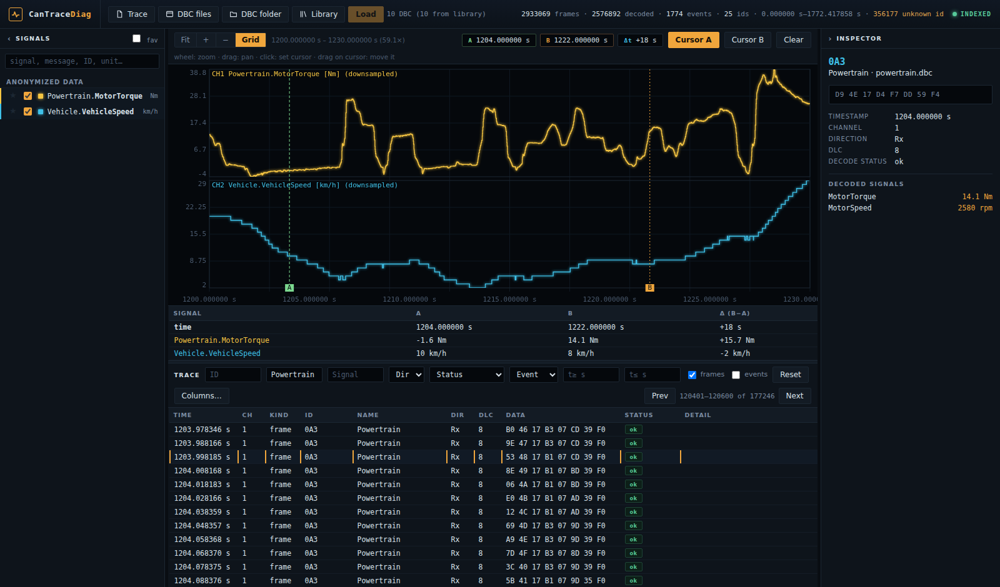
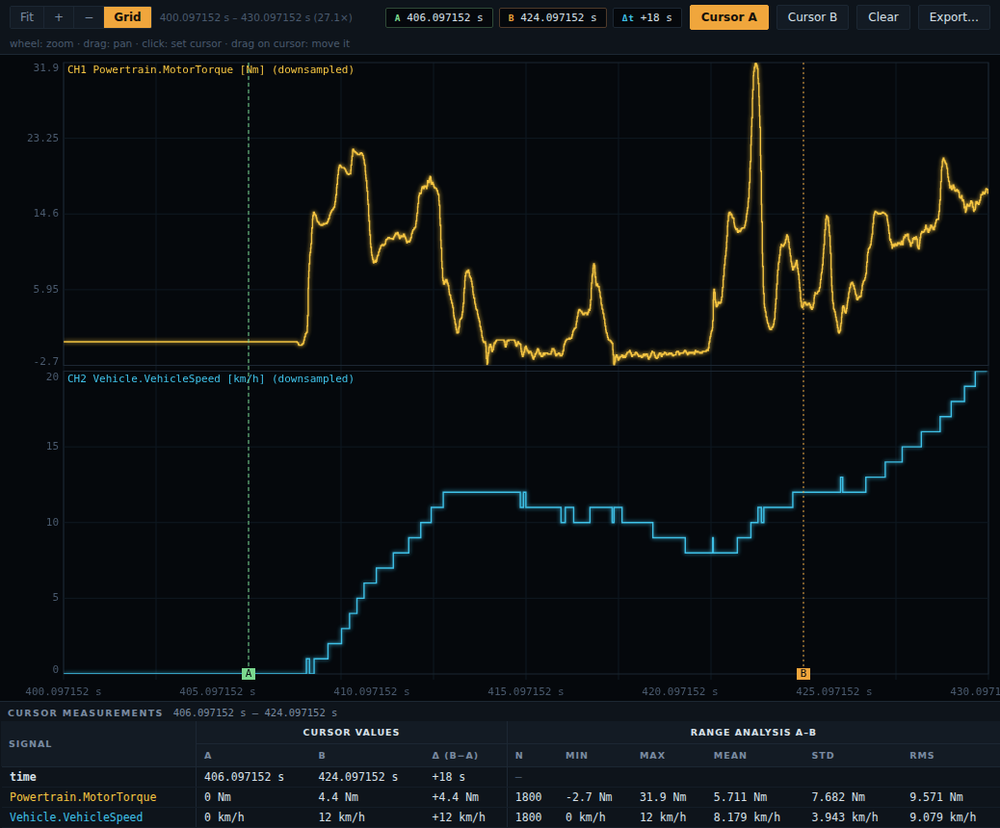
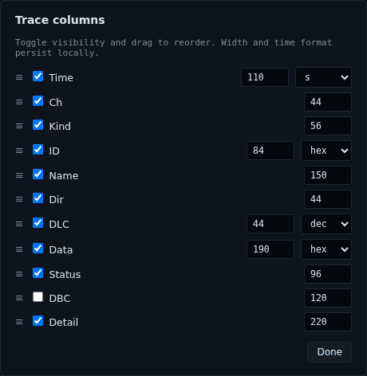
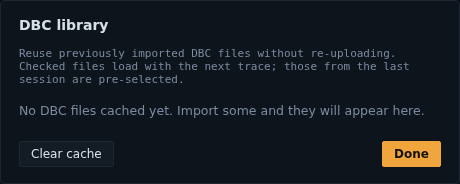

# CanTraceDiag

**CanTraceDiag turns a CANalyzer `.asc` trace and its DBC files into a local diagnostic workstation: import, decode, synchronized plots, A/B cursors, a filterable trace view, and session restore.**

The goal is direct: inspect real CAN acquisitions away from the vehicle, without a remote server, without keeping a proprietary tool open, and without loading the whole trace into the browser.



## Core Features

- **ASC + DBC import** from the browser or server-side paths.
- **Multi-DBC decoding** with ambiguous arbitration ID detection.
- **Stacked signal plots** with zoom, pan, grid, and A/B cursors.
- **Instant measurements** with cursor values and time/value deltas.
- **Range statistics** (count, min, max, mean, std, RMS) between the A and B cursors, with value distributions for text/enum signals.
- **Diagnostic report** summarizing the import: time range, volumes, DBCs used, and anomalies by type.
- **Streamed export** of selected signals to CSV or Parquet over a chosen range, with bounded memory.
- **Trace table** with pagination, filtering, and configurable columns.
- **Frame inspector** with raw payload, decoded message, and physical signals.
- **Local DBC library** to reuse databases without uploading them again.
- **Session restore** through a local workspace outside the repository.
- **One-click Windows + WSL launcher** with a desktop shortcut.

## Quick Start

Prerequisite: Python 3.11+.

```bash
git clone https://github.com/Jilanos/CanTraceDiag.git
cd CanTraceDiag
python -m venv .venv
source .venv/bin/activate
python -m pip install -U pip
python -m pip install -e ".[api,dev]"
cantracediag --help
pytest
cantracediag serve --open
```

[](https://github.com/Jilanos/CanTraceDiag/actions/workflows/ci.yml)

## Preview

### Plots And Cursors

Selected signals are rendered as stepped traces on a shared time axis. A/B cursors can be placed by click, moved by drag, and feed the measurement table below the plot.



### Trace Columns

The trace view is built for repeated inspection: filters, pagination, decode status, frame selection, and locally persisted column order, width, and format.



### DBC Library

Imported DBC files are kept in the user workspace, deduplicated by content, and reusable on the next load.



## Developer Setup

For local development, install the package with API and development dependencies:

```bash
python -m venv .venv
source .venv/bin/activate
python -m pip install -U pip
python -m pip install -e ".[api,dev]"
```

Recommended local validation:

```bash
.venv/bin/ruff check .
.venv/bin/pytest
```

## Run The UI

From the virtual environment:

```bash
cantracediag serve --open
```

From source without the installed script:

```bash
PYTHONPATH=src python -m cantracediag.cli serve --open
```

The default UI URL is:

```text
http://127.0.0.1:8000
```

If the requested port is already busy, `serve` picks a free one. If a CanTraceDiag instance is already running on that port, the command reopens the browser instead of starting a second server.

## One-Click Windows + WSL Launch

Run this once per Windows machine from Windows PowerShell:

```powershell
cd "\\wsl.localhost\Ubuntu\path\to\CanTraceDiag"
powershell.exe -NoProfile -ExecutionPolicy Bypass -File .\scripts\install-shortcut.ps1
```

The script creates:

- `CanTraceDiag.local.cmd` at the repository root, with the clone's WSL path baked in;
- a **CanTraceDiag** desktop shortcut;
- the project icon on that shortcut, copied to a Windows-local icon cache.

After that, double-clicking the shortcut starts the WSL server and opens the Windows browser. Re-run the script after moving the clone or after updating the icon.

## Quick Test

The synthetic fixtures exercise the full flow:

```bash
cantracediag info tests/fixtures/sample.asc --dbc tests/fixtures/sample.dbc
cantracediag signals tests/fixtures/sample.dbc
cantracediag serve --open
```

In the UI:

1. Click **Trace** and choose `tests/fixtures/sample.asc`.
2. Click **DBC files** and choose `tests/fixtures/sample.dbc`.
3. Click **Load**.
4. Select signals in the **Signals** panel.
5. Try zoom, pan, A/B cursors, trace filters, **Columns...**, **Library**, and **Clear cache**.

From the Windows browser, the WSL repository is visible through a path like:

```text
\\wsl.localhost\Ubuntu\path\to\CanTraceDiag\tests\fixtures
```

## Privacy And Sample Data

The fixtures in `tests/fixtures/` are synthetic and safe to version. Real traces, real DBC files, and generated workspaces should stay outside the repository; the default local workspace is ignored by Git.

## User Workflow

1. **Import** one `.asc` trace and one or more `.dbc` files.
2. **Resolve DBC conflicts** when several databases define the same arbitration ID with non-equivalent messages.
3. **Select signals** present in the trace or available in the DBC catalog.
4. **Explore plots** with zoom, pan, grid, and A/B cursors.
5. **Read range statistics** between cursors A and B for each selected signal.
6. **Inspect the trace** with filters, pagination, frame details, and decoded signals.
7. **Review the report** for the import synthesis and anomalies, then **export** the selected signals to CSV or Parquet over the range you choose (between A and B, the visible window, or the full trace).
8. **Reopen later** and let the workspace restore the last analysis and DBC library.

## Command Line

```bash
# Summarize an import
cantracediag info /path/to/trace.asc --dbc system.dbc --dbc auxiliary.dbc

# List messages and signals from one or more DBC files
cantracediag signals system.dbc

# Start the local UI
cantracediag serve --port 8000 --open

# Expose on the LAN (binds 0.0.0.0; the printed token protects the whole API)
cantracediag serve --lan --port 8000
```

## Local API

CanTraceDiag exposes a local FastAPI API used by the UI:

- `POST /api/import-files`: browser upload import;
- `POST /api/import`: server-side path import;
- `POST /api/resolve`: DBC conflict resolution;
- `GET /api/status`: session state;
- `GET /api/signals`: signal catalog;
- `GET /api/series`: windowed/downsampled series;
- `GET /api/cursor`: nearest cursor value for one signal (bounded lookup);
- `POST /api/cursors`: nearest values for N signals at cursors A and B in one call;
- `GET /api/signal-stats`: range statistics for one signal between two bounds;
- `GET /api/report`: import synthesis (volumes, DBCs used, anomalies by type);
- `POST /api/export`: streamed CSV/Parquet export of selected signals over a range;
- `GET /api/trace`: filtered trace view, paginated by opaque keyset cursor;
- `GET /api/frame-signals`: decoded signals for one frame;
- `GET /api/dbc-library`: DBC library;
- `POST /api/workspace-purge`: cache and last-analysis purge.

## Local Workspace

In normal mode, persistent data is stored outside the repository under:

```text
~/.local/share/cantracediag/
```

Useful variables:

- `CANTRACEDIAG_DATA_DIR`: change the workspace directory;
- `CANTRACEDIAG_DBC_CAP`: maximum number of retained DBC files, default `20`;
- `CANTRACEDIAG_EPHEMERAL=1`: disable persistence, used by the tests.

The repository ignores real traces, real DBC files, and caches to avoid versioning vehicle or customer data.

## Security

CanTraceDiag follows a local-first, Jupyter-style security model:

- it binds to loopback by default and rejects requests whose `Host` is not on an allowlist (DNS-rebinding defence) or whose `Origin` is cross-site;
- a per-process **session token** is generated at startup, embedded in the served page, and required on mutating endpoints locally and on **every** endpoint in `--lan` mode (the token is printed in the launch URL);
- uploads are capped by a documented limit;
- server-side path import is disabled in `--lan` mode so exposing the UI never grants arbitrary file reads;
- error messages never echo local filesystem paths.

Security variables:

- `CANTRACEDIAG_LAN=1`: protect the whole API with the token and disable server-path import;
- `CANTRACEDIAG_TOKEN`: pin the session token instead of generating one;
- `CANTRACEDIAG_HOST` / `CANTRACEDIAG_ALLOWED_HOSTS`: additional allowed `Host` values;
- `CANTRACEDIAG_MAX_UPLOAD_MB`: maximum upload size in MB, default `512`;
- `CANTRACEDIAG_ALLOW_SERVER_IMPORT`: force-enable/disable server-side path import.

## Architecture

```text
src/cantracediag/
├── api.py          # FastAPI + static UI
├── cli.py          # info, signals, serve commands
├── dbc.py          # multi-DBC loading + conflicts
├── decode.py       # physical signal decoding
├── formats/asc.py  # CANalyzer ASCII reader
├── pipeline.py     # ASC import -> index
├── store.py        # DuckDB + windowed queries
├── workspace.py    # DBC library + session restore
└── web/            # local UI, favicon, static assets
```

The backend keeps the DuckDB index local and only returns useful windows to the browser: downsampled series, trace pages, and frame details. That keeps the UI responsive as traces grow.

## README Screenshots

Screenshots are generated from the real application. The default mode starts an ephemeral server with a synthetic fixture:

```bash
.venv/bin/python scripts/capture-readme-screenshots.py
```

To regenerate README screenshots from an already running session, for example with a real POC3 trace loaded on port `8000`, run:

```bash
.venv/bin/python scripts/capture-readme-screenshots.py --url http://127.0.0.1:8000 --live-poc3
```

In that mode, plotted series come from the loaded trace, but business labels shown in screenshots are anonymized (`MotorTorque`, `VehicleSpeed`, and similar names).

## Current Status

Delivered today:

- ASC import;
- DBC decoding;
- DuckDB index;
- local UI with plots, trace table, inspector, and cursors;
- persistent workspace;
- DBC library;
- Windows + WSL shortcut;
- browser favicon and shortcut icon.

Known limits:

- BLF/MF4 support is not complete;
- no real-time replay;
- no native Windows package yet;
- no representative CI performance budget for large traces around 150 MB yet.
