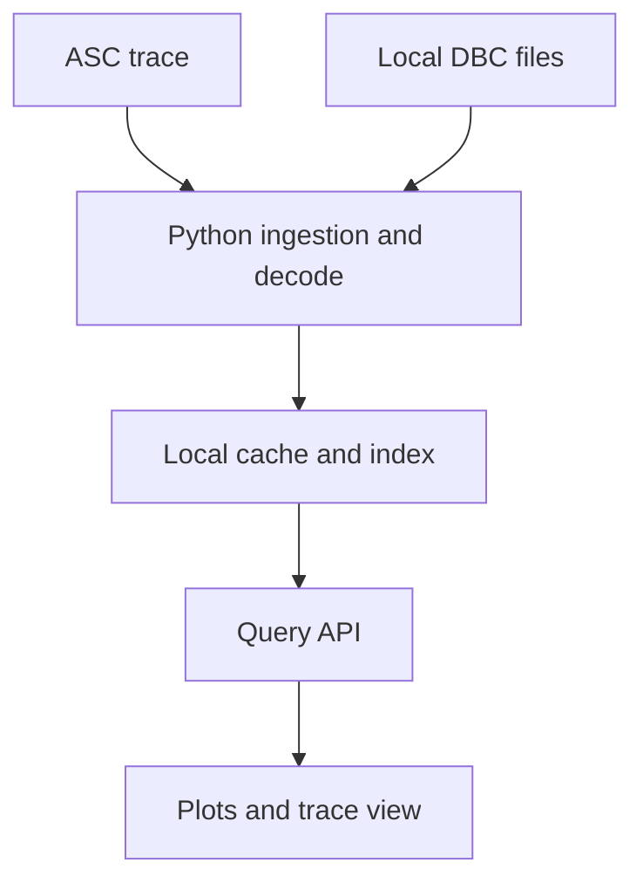

## adr_002_adr_architecture_cantracediag_mvp - ADR architecture CanTraceDiag MVP
> Date: 2026-07-15
> Status: Proposed
> Drivers: local-first, ASC MVP, DBC decode, stacked plots, configurable trace view
> Related request: `req_000_mvp_analyse_locale_traces_can_asc`
> Related backlog: (none yet)
> Related task: (none yet)
> Reminder: Update status, linked refs, decision rationale, consequences, and follow-up work when you edit this doc.
> Confidence: 90
> Non-semantic edit: Align delivered-state wording with the current implementation.

# Overview
This ADR captures the MVP architecture for CanTraceDiag.

# Drivers
- Keep acquisition data local and out of Git.
- Preserve a future path for BLF/MF4 import.
- Support trace sizes observed around 40-150 MB without loading everything in the browser.
- Provide a CANalyzer-like graph and trace inspection workflow.

# Context
- The initial data source is CANalyzer ASCII `.asc`.
- The MVP targets one CAN bus per acquisition.
- DBC files are local and may overlap across systems, but one acquisition should use only one coherent battery/system set.
- Example traces are 43-148 MB, 267-812 seconds, about 400k-1.24M useful CAN frames, and 27-28 unique IDs.
- Some traces include many non-data events such as `ErrorFrame`.
- Usage is local under WSL first, with later Windows/Linux compatibility.

# Decision
- Build a local web application.
- Use Python for ASC ingestion, DBC parsing, decoding, and local indexing.
- Use a frontend web UI for plots, signal selection, cursor UX, and virtualized trace table.
- Normalize source formats into raw frame/event and decoded signal tables.
- Use a local DuckDB cache/index layer. API imports use a temporary `.duckdb`
  file outside the repository; CLI imports may still use in-memory storage for
  short diagnostic commands.
- Keep traces, DBC, CANalyzer configs, and generated caches out of Git.

# Consequences
- The backend can evolve from ASC to BLF/MF4 without changing the UI contract.
- The UI can query time windows and filters instead of loading complete traces.
- The project keeps a code/documentation-only public repository.
- The MVP has two implementation surfaces, backend and frontend, but this is necessary for a CANalyzer-like trace table and graph experience.
- Multi-DBC conflicts are explicit: non-equivalent duplicate arbitration IDs
  require an operator decision, while equivalent duplicates can be accepted.
- The current product does not include BLF/MF4, replay, cloud collaboration or
  native Windows packaging.

# References
- Related request: `req_000_mvp_analyse_locale_traces_can_asc`
- Related backlog: `item_001_mvp_analyse_locale_traces_can_asc`
- Related task: `task_001_mvp_analyse_locale_traces_can_asc`
- Architecture docs: `docs/adr/`
