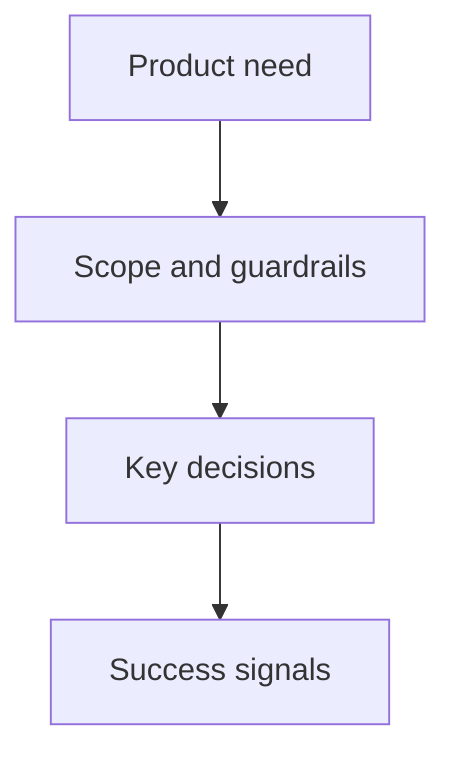

## prod_002_product_brief_cantracediag_mvp - Product brief CanTraceDiag MVP
> Date: 2026-07-15
> Status: Proposed
> Related request: `req_000_mvp_analyse_locale_traces_can_asc`
> Related backlog: (none yet)
> Related task: (none yet)
> Related architecture: (none yet)
> Reminder: Update status, linked refs, scope, decisions, success signals, and open questions when you edit this doc.

# Overview
CanTraceDiag MVP is a local diagnostic tool for CANalyzer ASC traces and local DBC files. It helps engineers inspect vehicle acquisitions offline through synchronized signal plots and a configurable trace view.

# Goals
- Load a CANalyzer ASC trace from local disk.
- Load one or more local DBC files without committing them to Git.
- Decode CAN messages into physical signals.
- Display selected signals as stacked subplots with a shared time axis.
- Provide nearest-sample cursor values and deltas.
- Provide a CANalyzer-inspired configurable trace table.

# Non-goals
- Real-time replay with play/pause/speed controls.
- Multi-bus support in the MVP.
- Cloud or multi-user collaboration.
- BLF/MF4 import in the first delivery.
- Versioning real traces, DBC, or CANalyzer configs.

# Scope and guardrails
- In: local WSL-first workflow, ASC import, DBC loading, single CAN bus, stacked signal plots, nearest-sample cursor, trace view.
- Out: dynamic replay, remote storage, packaging polish, and native Windows distribution for the MVP.
- Keep large and acquisition-specific files outside the repository.
- Use synthetic or anonymized fixtures for tests.

# Key product decisions
- Primary format is CANalyzer ASCII `.asc`.
- Future formats should plug into the same normalized internal model.
- DBC ID overlaps may exist between DBC files, but not within one acquisition; the MVP must detect and expose ambiguity.
- Graphs use stacked subplots by default, not multiple Y axes overlaid on one plot.
- Cursor values use nearest samples; no interpolation in MVP.
- Trace columns must be user-configurable over time: visibility, order, width, and display format.

# Success signals
- A 40-150 MB ASC file can be imported locally.
- 400k-1.25M useful CAN frames remain queryable without loading the entire trace in the browser.
- The UI lists messages/signals from multiple DBCs.
- Selected signals render as synchronized subplots.
- The trace view includes raw frames, decoded names/signals where available, and non-data events such as ErrorFrame and CAN Status.

# References
- Product back-reference: `docs/product-brief.md`
- Task back-reference: (none yet)
