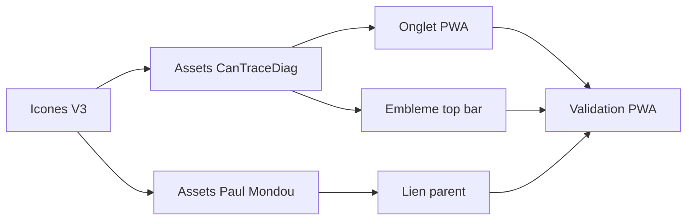

## prod_005_identite_cantracediag_alignee_sur_icones_v3 - Identite CanTraceDiag alignee sur Icones V3
> Date: 2026-08-05
> Status: Settled
> Related request: `req_017_integrer_les_icones_icones_v3_et_le_lien_parent_paul_mondou_dans_cantracediag`
> Related backlog: `item_034_remplacer_favicon_et_embleme_cantracediag_par_icones_v3`
> Related task: `task_036_orchestrer_l_integration_icones_v3_dans_cantracediag`
> Related architecture: (none yet)
> Reminder: Update status, linked refs, scope, decisions, success signals, and open questions when you edit this doc.

# Overview
CanTraceDiag remplace son favicon, son embleme et son lien parent par les assets Icones V3.

# Goals
- Aligner la top bar et les metadata d'onglet sur Icones V3.
- Preserver le fonctionnement PWA local-first et les validations existantes.
- Rendre le lien parent Paul Mondou coherent avec les autres sites enfants.

# Non-goals
- Modifier le moteur ASC/DBC ou les workflows diagnostic.
- Changer la strategie PWA, service worker ou packaging hors references d'assets.

# Scope and guardrails
- In: scaffolded request, product, backlog, orchestration task, validation, and handoff context.
- Out: unrelated workflow docs and implementation of generated tasks.

# Key product decisions
- Use structured input as the source of truth for generated docs.
- Keep generated write paths local and repo-bounded.

# Success signals
- Generated docs pass lint and audit without broad manual rewrites.
- Context-pack output can be handed to an implementation agent directly.

# References
- Product back-reference: `item_034_remplacer_favicon_et_embleme_cantracediag_par_icones_v3`
- Task back-reference: `task_036_orchestrer_l_integration_icones_v3_dans_cantracediag`
