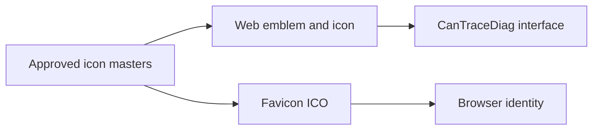

## prod_007_identite_cantracediag_alignee_sur_icones_v3_corrige - Identite CanTraceDiag alignee sur Icones V3 corrige
> Date: 2026-08-06
> Status: Settled
> Related request: `req_020_remplacer_les_assets_cantracediag_par_les_masters_icones_v3_corriges`
> Related backlog: `item_038_remplacer_les_assets_web_et_l_ico_cantracediag`
> Related task: `task_039_remplacer_les_assets_cantracediag_par_les_masters_icones_v3_corriges`
> Related architecture: (none yet)
> Reminder: Update status, linked refs, scope, decisions, success signals, and open questions when you edit this doc.
> Indicators reviewed: 2026-08-21 09:58:09

# Overview
Servir les masters approuves sur l'interface web et le favicon ICO.

# Goals
- Une source unique pour l'icone, l'embleme et l'ICO.
- Des references coherentes avec le format reellement servi.

# Non-goals
- Introduire un theme clair.

# Scope and guardrails
- In: scaffolded request, product, backlog, orchestration task, validation, and handoff context.
- Out: unrelated workflow docs and implementation of generated tasks.

# Key product decisions
- Use structured input as the source of truth for generated docs.
- Keep generated write paths local and repo-bounded.

# Success signals
- Generated docs pass lint and audit without broad manual rewrites.
- Context-pack output can be handed to an implementation agent directly.

# References
- Product back-reference: `item_038_remplacer_les_assets_web_et_l_ico_cantracediag`
- Task back-reference: `task_039_remplacer_les_assets_cantracediag_par_les_masters_icones_v3_corriges`
