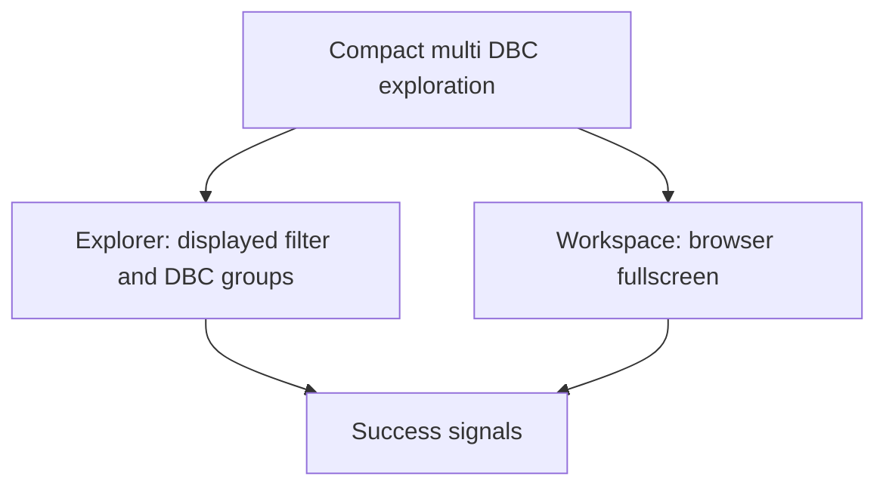

## prod_008_compact_signal_exploration_for_cantracediag - Compact signal exploration for CanTraceDiag
> Date: 2026-08-20
> Status: Settled
> Related request: `req_021_make_the_signal_explorer_more_efficient_on_compact_screens`
> Related backlog: `item_040_add_displayed_filtering_and_collapsible_ordered_dbc_groups_to_the_signal_explorer`
> Related task: `task_040_deliver_compact_signal_explorer_navigation_and_browser_fullscreen`
> Related architecture: (none yet)
> Reminder: Update status, linked refs, scope, decisions, success signals, and open questions when you edit this doc.
> Indicators reviewed: 2026-08-20 11:09:11

# Overview
Improve selection and navigation of multi-DBC signal catalogs while recovering workspace area on small displays.

# Goals
- Make already plotted signals immediately discoverable.
- Keep every imported DBC discoverable without permanently consuming explorer height.
- Offer application-controlled document fullscreen with truthful browser state.

# Non-goals
- Change CAN decoding, DBC conflict resolution, or the persisted DBC library.
- Programmatically trigger the browser F11 mode or suppress browser exit controls.
- Introduce a mobile-only layout or alter plot data and rendering semantics.

# Scope and guardrails
- In: scaffolded request, product, backlog, orchestration task, validation, and handoff context.
- Out: unrelated workflow docs and implementation of generated tasks.

# Key product decisions
- Use structured input as the source of truth for generated docs.
- Keep generated write paths local and repo-bounded.

# Success signals
- Generated docs pass lint and audit without broad manual rewrites.
- Context-pack output can be handed to an implementation agent directly.

# References
- Product back-reference: `item_040_add_displayed_filtering_and_collapsible_ordered_dbc_groups_to_the_signal_explorer`
- Task back-reference: `task_040_deliver_compact_signal_explorer_navigation_and_browser_fullscreen`
