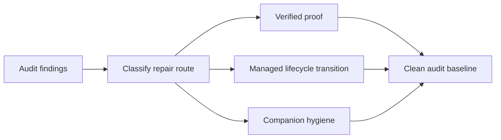

## prod_011_reliable_logics_workflow_governance - Reliable Logics workflow governance
> Date: 2026-08-21
> Status: Settled
> Related request: `req_024_restore_logics_workflow_integrity_and_audit_closure`
> Related backlog: `item_044_resolve_legacy_acceptance_criteria_traceability_and_lifecycle_debt`
> Related task: `task_043_deliver_clean_logics_workflow_audit_baseline`
> Related architecture: (none yet)
> Reminder: Update status, linked refs, scope, decisions, success signals, and open questions when you edit this doc.
> Indicators reviewed: 2026-08-21 09:59:09

# Overview
Establish a clean, evidence-backed Logics corpus whose lifecycle state, traceability, companion documents, and audit results give implementers a reliable source of truth.

# Goals
- Make every active workflow document actionable and every historical document truthfully resolved or linked.
- Remove audit blockers without masking missing evidence or bypassing lifecycle controls.
- Make corpus-wide validation a dependable gate for future task closeouts.

# Non-goals
- Change application functionality, UI behavior, trace parsing, or deployment infrastructure.
- Rewrite product history solely to make document counts smaller.
- Create new release versions, tags, or remote publications.

# Scope and guardrails
- In: scaffolded request, product, backlog, orchestration task, validation, and handoff context.
- Out: unrelated workflow docs and implementation of generated tasks.

# Key product decisions
- Use structured input as the source of truth for generated docs.
- Keep generated write paths local and repo-bounded.

# Success signals
- Generated docs pass lint and audit without broad manual rewrites.
- Context-pack output can be handed to an implementation agent directly.

# References
- Product back-reference: `item_044_resolve_legacy_acceptance_criteria_traceability_and_lifecycle_debt`
- Task back-reference: `task_043_deliver_clean_logics_workflow_audit_baseline`
