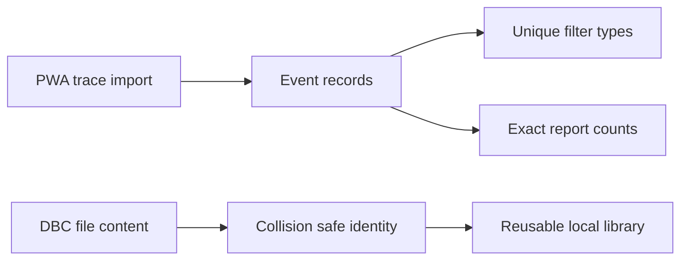

## prod_012_trustworthy_browser_local_diagnostics - Trustworthy browser-local diagnostics
> Date: 2026-08-22
> Status: Proposed
> Related request: `req_026_restore_browser_local_diagnostic_data_integrity`
> Related backlog: `item_047_preserve_exact_anomaly_counts_in_browser_local_reports`, `item_048_adopt_collision_safe_browser_local_dbc_content_identity`
> Related task: `task_044_deliver_browser_local_diagnostic_integrity_remediation`
> Related architecture: (none yet)
> Reminder: Update status, linked refs, scope, decisions, success signals, and open questions when you edit this doc.
> Indicators reviewed: 2026-08-22 12:23:25

# Overview
Ensure that the static PWA preserves diagnostic evidence and local DBC assets accurately enough for operators to trust reports and repeated analysis sessions.

# Goals
- Report imported anomaly multiplicities exactly and consistently across browser-local and Python reference paths.
- Give each distinct DBC content a stable, collision-safe identity while preserving content deduplication.
- Turn both reproduced failures into permanent automated regression contracts.

# Non-goals
- Redesign the diagnostic report, event taxonomy, signal explorer, or DBC parser.
- Deliver chunked 500 MB imports, OPFS or IndexedDB trace persistence, or broader PWA migration scope.
- Recover a legacy DBC entry whose content was already overwritten before this correction.
- Change Python backend behavior beyond parity-test fixtures or assertions required to express the existing reference contract.

# Scope and guardrails
- In: exact browser-local event counts, collision-safe DBC content identity, compatibility for valid legacy library entries, focused parity tests, and patch-release evidence.
- Out: event-taxonomy redesign, DBC parser expansion, large-file storage architecture, recovery of already-overwritten content, and unrelated Python behavior.

# Key product decisions
- Preserve the unique event-type list used by trace filters while adding a separate exact count contract for diagnostic reporting.
- Treat content identity and display filename as separate concepts; identity must distinguish different bytes and deduplicate identical bytes.
- Preserve valid legacy library entries through explicit compatibility or migration behavior, without implying that previously overwritten bytes can be reconstructed.
- Deliver the two corrections as separate backlog slices with one shared validation and patch-release closeout.

# Success signals
- A repeated-event fixture reports and renders exact multiplicities while filter values remain unique.
- A deterministic legacy hash collision produces two usable DBC entries, while identical bytes still deduplicate.
- Valid legacy library data remains usable after the change and malformed data fails safely.
- Focused and full validations pass, and commit, CI, tag, and release evidence are recorded before closeout.

# References
- Product back-reference: `req_026_restore_browser_local_diagnostic_data_integrity`
- Task back-reference: `task_044_deliver_browser_local_diagnostic_integrity_remediation`
