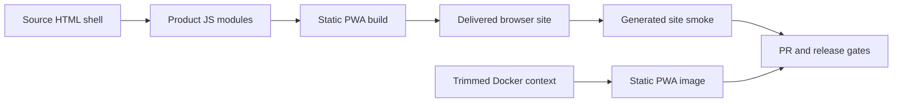

## prod_013_reliable_static_pwa_delivery - Reliable static PWA delivery
> Date: 2026-08-23
> Status: Proposed
> Related request: `req_028_harden_static_pwa_delivery_and_release_validation`
> Related backlog: `item_049_prevent_static_pwa_module_omissions_and_restore_fullscreen_delivery`, `item_050_run_generated_site_browser_smoke_in_ci_and_release_validation`, `item_051_shrink_docker_build_context_for_the_static_pwa_image`, `item_052_resolve_residual_audit_governance_and_release_hardening_debt`
> Related task: `task_045_deliver_static_pwa_delivery_and_release_hardening`
> Related architecture: (none yet)
> Reminder: Update status, linked refs, scope, decisions, success signals, and open questions when you edit this doc.
> Indicators reviewed: 2026-08-23 09:47:33

# Overview
Make the static PWA build and release path trustworthy enough that documented browser features cannot disappear silently between the source shell and the deployed artifact.

# Goals
- Keep source HTML, JavaScript modules, generated bundles, and delivered-browser behavior in sync.
- Run the same user-relevant PWA checks during development, CI, and release validation.
- Trim avoidable build context and record the remaining audit debt in scoped, traceable workflow items.

# Non-goals
- Redesign the diagnostic workspace UI, parser model, charting behavior, or DBC workflows.
- Replace the full PWA architecture in this request beyond the scoped delivery-hardening changes.
- Perform a broad dependency modernization unrelated to the specific audit findings.
- Close stale historical Logics chains without reviewing their actual implementation and release evidence.

# Scope and guardrails
- In: scaffolded request, product, backlog, orchestration task, validation, and handoff context.
- Out: unrelated workflow docs and implementation of generated tasks.

# Key product decisions
- Use structured input as the source of truth for generated docs.
- Keep generated write paths local and repo-bounded.

# Success signals
- Generated docs pass lint and audit without broad manual rewrites.
- Context-pack output can be handed to an implementation agent directly.

# References
- Product back-reference: `req_028_harden_static_pwa_delivery_and_release_validation`
- Task back-reference: `task_045_deliver_static_pwa_delivery_and_release_hardening`
