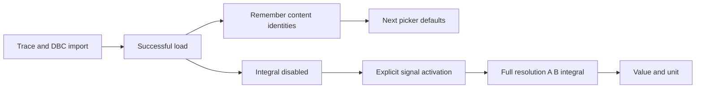

## prod_015_optional_cursor_integration_and_reusable_dbc_import_defaults - Optional cursor integration and reusable DBC import defaults
> Date: 2026-09-30
> Status: Settled
> Related request: `req_032_add_opt_in_cursor_integral_analysis_and_restore_the_last_loaded_dbc_selection`
> Related backlog: `item_054_compute_exact_range_numeric_signal_integrals_in_local_and_server_stores`
> Related task: `task_047_deliver_opt_in_signal_integral_analysis_and_remembered_dbc_loading`
> Related architecture: (none yet)
> Reminder: Update status, linked refs, scope, decisions, success signals, and open questions when you edit this doc.
> Indicators reviewed: 2026-09-30 13:57:06

# Overview
Extend cursor diagnostics with a deliberately enabled integral for one signal and make repeated trace loading reuse the exact previous DBC selection across restarts.

# Goals
- Provide trustworthy optional numeric integration without crowding the default analysis panel.
- Reduce repeated import clicks while keeping the operator in control of DBC selection.
- Maintain consistent local PWA and server behavior.

# Non-goals
- Implement symbolic integration, cumulative integral plots, differentiation, automatic unit conversion, or multiple integration methods.
- Enable integral analysis automatically or persist its enabled state between traces or page reloads.
- Autoload a trace, automatically select the entire library, change decoding/conflict policy, or restore an entire PWA analysis session.
- Change DBC hashing or library deduplication independently of existing identity contracts.

# Scope and guardrails
- In: numeric cursor-range integral engine, ephemeral per-signal opt-in UI, persistent content-identity DBC selection, and local/server regression coverage.
- Out: symbolic math, integral plots, alternate methods, automatic unit conversion, automatic trace loading, and full browser session restoration.

# Key product decisions
- Integral mode is off for every fresh trace and browser reload; only one explicitly chosen signal is analyzed.
- Use signed trapezoidal integration with interpolated boundaries on full-resolution samples, disclose the method, and avoid extrapolation.
- Remember the DBC set from the last completed successful import by canonical content identity, including uploaded and library-reused files.
- Apply defaults once to untouched picker state; manual changes remain authoritative, including an empty set.
- Failed or unresolved imports preserve the last successful set; workspace purge clears it.

# Success signals
- Default cursor analysis performs no integral-specific work and displays no integral result.
- Known numeric fixtures agree in Python and TypeScript and remain unchanged under plot zoom or decimation.
- After reload, selecting only a new trace reuses the previous DBC set; uncheck-all remains respected.

# Open questions
- None blocking development. Trapezoidal interpolation is a deliberate product assumption and differs from the existing canvas step rendering.

# Overview diagram

# References
- Product back-reference: `item_054_compute_exact_range_numeric_signal_integrals_in_local_and_server_stores`
- Task back-reference: `task_047_deliver_opt_in_signal_integral_analysis_and_remembered_dbc_loading`
