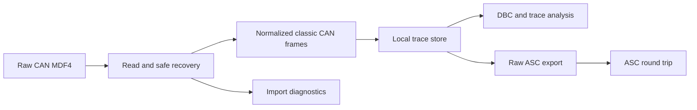

## prod_016_raw_mf4_can_import_and_interoperable_asc_trace_export - Raw MF4 CAN import and interoperable ASC trace export
> Date: 2026-10-01
> Status: Proposed
> Related request: `req_033_read_raw_can_mf4_recordings_and_save_traces_as_asc`
> Related backlog: `item_057_import_third_party_raw_can_mf4_including_unfinished_recordings`, `item_058_stream_stored_raw_can_frames_to_round_trip_safe_asc_exports`, `item_059_expose_mf4_import_and_raw_asc_download_with_explicit_server_capability`
> Related task: `task_048_deliver_raw_can_mf4_import_and_asc_trace_export`
> Related architecture: (none yet)
> Reminder: Update status, linked refs, scope, decisions, success signals, and open questions when you edit this doc.

# Overview
Let operators analyze third-party MDF4 raw classic-CAN recordings and save normalized raw frames as an interoperable ASC trace, with safe unfinished-file handling and transparent conversion limits.

# Goals
- Import the supplied unfinished sample and documented finalized raw CAN MDF4 layouts safely in server mode.
- Retain raw trace fidelity independently of DBC availability and decoded-signal selection.
- Offer streaming ASC downloads for full, A/B and visible ranges with round-trip evidence and explicit exclusion counts.

# Non-goals
- Import predecoded-only MDF signals, decode LIN/FlexRay/Ethernet, implement CAN FD/XL or replay.
- Write MF4, alter the source recording, preserve all MDF metadata in ASC or promise arbitrary MDF vendor-layout coverage.
- Implement browser-local MF4 parsing or browser-local ASC export in this delivery.
- Change existing CSV/Parquet signal export schemas, security limits or DBC-selection semantics.

# Scope and guardrails
- Server-backed raw classic-CAN MDF4 import, including the supplied unfinished layout, and ASC download from normalized stored frames.
- Existing ASC/TRC/BLF traces also benefit from ASC export; full, A/B and visible ranges are supported independently of signals and display filters.
- Source recordings stay read-only and outside git. Recovery uses in-memory handling or a disposable copy, with explicit warnings and integrity checks.
- FD/XL, remote/error events and non-CAN data are diagnosed rather than emitted as classic data frames. Export exclusions are disclosed.

# Key product decisions
- Preserve measurement-relative timestamps and original numeric bus identifiers; do not rebase groups or exported ranges.
- Stream raw frame output without decoded-signal dependencies. Preserve known Rx/Tx and use an explicit safe policy when channel/direction is unknown.
- Prefer a maintained MDF library behind a project-owned adapter; choose its version and recovery strategy only after verifying the third-party sample.
- Keep MF4 import and ASC export server-only for this delivery; static PWA advertises its actual text capabilities.

# Success signals
- External sample imports non-empty and yields independently verified counts/values with its source SHA-256 unchanged.
- MF4 -> ASC -> ASC re-import preserves frame counts and raw values; timestamp error is at most 1 microsecond for representable values.
- No DBC or selected signal is needed for raw export; existing signal exports and trace formats pass regression coverage.
- Large recordings use bounded reader fragments/store batches/export output with measured memory and cancellation evidence.

# Overview diagram

# References
- Product back-reference: `req_033_read_raw_can_mf4_recordings_and_save_traces_as_asc`
- Task back-reference: `task_048_deliver_raw_can_mf4_import_and_asc_trace_export`
